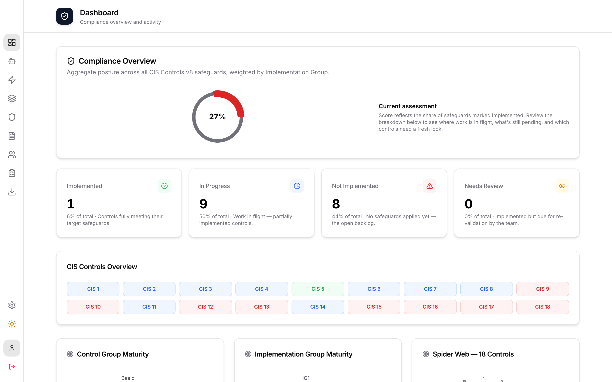
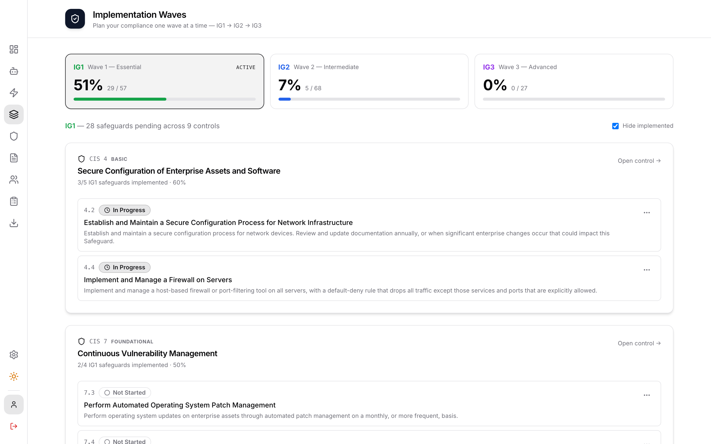
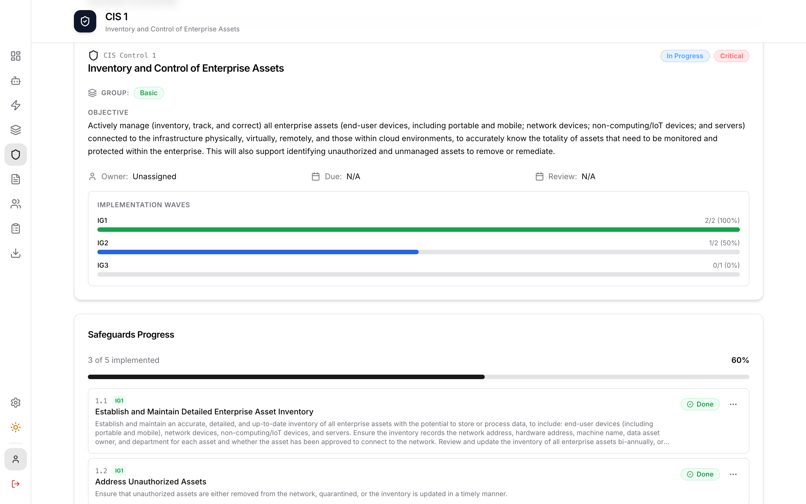
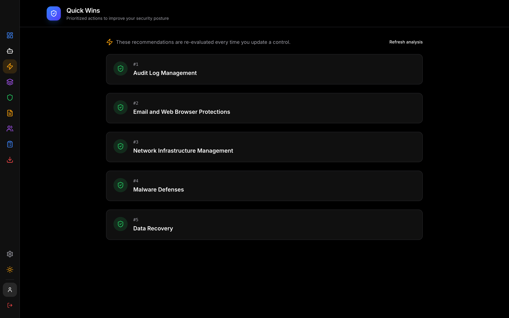
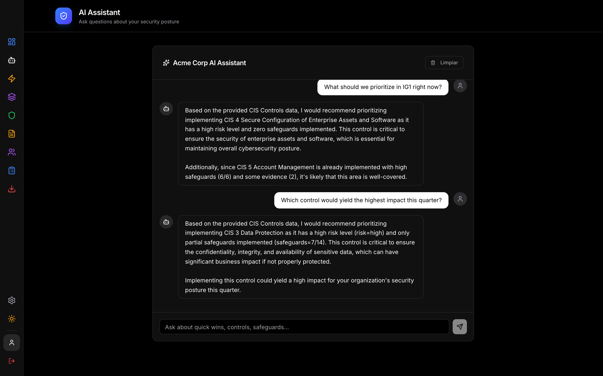
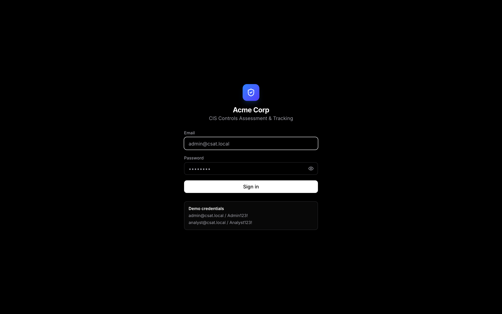

# CSAT — CIS Controls Assessment & Tracking

<!-- README-I18N:START -->

**English** | [Español](./README.es.md)

<!-- README-I18N:END -->

Open-source, self-hosted platform for managing **CIS Controls v8** end-to-end:
implementation status per control and per safeguard, evidence, audit logs,
PDF/Excel reports with an AI-generated executive summary, and a chat
assistant grounded in your real posture data.

Built for security teams that want a single source of truth for compliance
without sending data to a third-party SaaS.

## Screenshots

<table>
  <tr>
    <td width="50%"><br/><sub><b>Dashboard</b> — compliance score, status mix, control / IG maturity, spider web</sub></td>
    <td width="50%"><br/><sub><b>Implementation Waves</b> — tackle IG1 / IG2 / IG3 one wave at a time</sub></td>
  </tr>
  <tr>
    <td width="50%"><br/><sub><b>Control detail</b> — status, owner, transition timestamps, per-IG progress</sub></td>
    <td width="50%"><br/><sub><b>Quick Wins</b> — top 5 actions ranked by heuristic + LLM</sub></td>
  </tr>
  <tr>
    <td width="50%"><br/><sub><b>AI Assistant</b> — chat grounded in your real control data, with persistent history</sub></td>
    <td width="50%"><br/><sub><b>Login</b> — branded with the customer's logo and platform name</sub></td>
  </tr>
</table>

## Architecture

```
┌─────────────────────────────────────────────────────────────┐
│                    React 19 Frontend                         │
│  Dashboard · Controls · Implementation Waves · Quick Wins    │
│  Evidence · Users · Audit Logs · AI Assistant · Reports      │
│  Tailwind 4 · Vite 8 · Recharts · jsPDF · motion             │
└─────────────────────────────────────────────────────────────┘
                              │ REST API (cookies httpOnly)
┌─────────────────────────────────────────────────────────────┐
│                    FastAPI Backend                           │
│  JWT + Argon2id · RBAC · APScheduler · structlog            │
│  18 CIS Controls v8 + 152 safeguards + IG1/IG2/IG3 mapping  │
└─────────────────────────────────────────────────────────────┘
                              │
                              ▼
┌─────────────────────────────────────────────────────────────┐
│   SQLite   ·   Local Ollama / OpenAI / Anthropic for AI     │
└─────────────────────────────────────────────────────────────┘
```

---

## Prerequisites

- **Docker** + **Docker Compose** (the only hard dependency)
- ~500 MB disk for images, plus volumes for the SQLite DB and uploaded evidence
- *(Optional, for AI features)* **Ollama** running locally — see [Configure the AI assistant](#configure-the-ai-assistant)

A modern browser. No other runtime installation is needed for the Docker path.

---

## Quick start (Docker)

```bash
# 1. Clone and prepare environment
git clone <your-fork-url> csat
cd csat
cp .env.example .env

# 2. Generate a real SECRET_KEY (replace the placeholder in .env)
python3 -c "import secrets; print('SECRET_KEY=' + secrets.token_urlsafe(48))"
# → paste the output into .env, replacing the existing SECRET_KEY line

# 3. Build and start
docker compose up --build -d

# 4. Open the app
open http://localhost
```

Sign in with the seeded admin account: `admin@csat.local` / `Admin123!`
(see [Hardening](#hardening-for-production) before exposing the instance).

The first start will:

- create the SQLite database under the `csat-data` volume,
- seed the 18 CIS Controls v8 + 152 safeguards (IG1/IG2/IG3 tagged),
- create default users and roles,
- start the daily review-reminder scheduler.

---

## First-time setup (post-login)

Once you are logged in as admin:

1. **Settings → Branding** — set the company / platform name and upload a logo.
   Both surface on the dashboard header, the login screen, the browser tab and
   on every PDF/Excel report cover.
2. **Settings → AI** — configure the LLM provider. Ollama is the default and
   works fully offline. See [Configure the AI assistant](#configure-the-ai-assistant).
3. **Users** — create real accounts and rotate the default `admin@csat.local`
   password. Demo credentials are seeded *every restart*; treat them as ephemeral.
4. **Controls → assign owners** — every control without an owner gets flagged
   in Quick Wins and the executive summary.

You're now ready to start tracking implementation per safeguard.

---

## Day-to-day operation

| Page | What you do there |
|------|-------------------|
| **Dashboard** | Compliance score (avg per-control completion), risk distribution, IG maturity, recent activity. |
| **Controls** | List of all 18 CIS Controls. Filter by status / risk / owner. |
| **Control detail** | Edit status, owner, due date, review date. Toggle each safeguard's status. Upload evidence files or external links. Add comments / activity history. |
| **Implementation Waves** | Pick IG1, IG2 or IG3 and tackle that wave's safeguards in one place — grouped by parent control, with inline status editing. Use this when you want to bring a wave from 0% to 100%. |
| **Quick Wins** | Heuristic-ranked + LLM-analyzed top 5 controls to address next, weighted by IG1 pending, risk, and missing owners/evidence. |
| **AI Assistant** | Ask questions about your posture in natural language. Has memory across sessions and is grounded in your real control data. |
| **Audit Logs** | Immutable log of every login, control update, evidence upload, etc. |
| **Export Report** | Generates a 5-page PDF (cover with donut score, exec summary by AI, compliance overview, IG cards, top quick wins, control inventory by group) and a 3-sheet Excel workbook. |

### Status semantics

A safeguard is `not_implemented` / `in_progress` / `implemented`.

A control's status is **derived** from its safeguards:

- All safeguards `implemented` → control is `implemented`
- At least one in `implemented` or `in_progress` → control is `in_progress`
- Otherwise → `not_implemented`

You can also manually flag a control as `needs_review` from the Edit panel.
Transition timestamps (`started_at`, `implemented_at`) are recorded automatically.

The **compliance score** is the average of each control's safeguard completion
percentage — every control weighs equally regardless of how many safeguards
it has.

---

## Configure the AI assistant

CSAT supports three providers. The AI is optional — without it you still get
the heuristic Quick Wins and a fallback executive summary in PDF reports.

### Option A — Ollama (local, recommended)

```bash
# Install Ollama on the host where CSAT runs
brew install ollama          # macOS
# or: curl -fsSL https://ollama.com/install.sh | sh   # Linux

# Pull a model (first run downloads ~4-5 GB)
ollama pull llama3:latest

# Bind Ollama to all interfaces so the Docker container can reach it
OLLAMA_HOST=0.0.0.0 ollama serve
```

In CSAT → **Settings → AI**:

- Provider: `ollama`
- API URL: `http://host.docker.internal:11434` (works from Docker Desktop on
  macOS / Windows; Linux Docker requires `extra_hosts: host.docker.internal:host-gateway`,
  already set in `docker-compose.yml`)
- Model: `llama3:latest` (or any model you've pulled — `qwen2.5:7b-instruct-q4_K_M`,
  `mistral:7b-instruct`, etc.)

Click **Test Connection**. You should get `{"status":"ok"}`.

### Option B — OpenAI

- Provider: `openai`
- API URL: leave empty (defaults to `https://api.openai.com`)
- API Key: your `sk-...` key
- Model: `gpt-4o-mini` (cheap) or `gpt-4o`

### Option C — Anthropic

- Provider: `anthropic`
- API URL: leave empty (defaults to `https://api.anthropic.com`)
- API Key: your `sk-ant-...` key
- Model: `claude-haiku-4-5-20251001` or any current Claude model ID

---

## Single Sign-On (Keycloak, AD via federation)

CSAT supports OIDC SSO via Authorization Code Flow + PKCE. Keycloak ships
in `docker-compose.yml` under the optional `sso` profile, so it stays out
of the way unless you explicitly want it.

### Local Keycloak demo (5 minutes)

```bash
# 1. Start Keycloak alongside CSAT
docker compose --profile sso up -d

# 2. Seed a realm, client, four groups (csat-admins/analysts/auditors/viewers)
#    and two test users (alice → admin, bob → analyst). Idempotent.
scripts/seed-keycloak.py

# The script prints the client secret. Save it for the next step.
```

Open Keycloak admin console at `http://localhost:8081` (admin/admin) to inspect.

### Wire it into CSAT

From the CSAT admin UI, or via the API:

```bash
curl -b cookies.txt -X PUT http://localhost/api/settings/oidc_config \
  -H "Content-Type: application/json" -d '{
    "value": {
      "enabled": true,
      "issuer_url": "http://host.docker.internal:8081/realms/csat",
      "client_id": "csat-app",
      "client_secret": "<the secret seed-keycloak.py printed>",
      "group_role_map": {
        "csat-admins":   "Admin",
        "csat-analysts": "Security Analyst",
        "csat-auditors": "Auditor",
        "csat-viewers":  "Viewer"
      },
      "default_role": "Viewer"
    }
  }'
```

Reload `/login` — a **Sign in with corporate SSO** button appears. Sign in with
`alice / Test123!` (mapped to `csat-admins` → Admin) or `bob / Test123!`
(mapped to `csat-analysts` → Security Analyst). The user is JIT-provisioned
into the CSAT users table on first login; subsequent logins update their roles
to whatever the IdP currently says.

### Connecting an existing Active Directory

Same OIDC flow — Keycloak federates LDAP / AD natively. In the Keycloak admin
console: **User Federation → Add provider → ldap**, point at your DC, configure
the bind DN and search base, then enable group sync. Map the AD groups you want
to expose as `csat-admins` / `csat-analysts` / etc. CSAT does not change.

The same pattern works with **Entra ID (Azure AD)**, **Okta**, **ADFS** or any
other OIDC-compliant provider — adjust `issuer_url`, `client_id` and
`client_secret` accordingly. The group claim must be present in either the ID
token or the userinfo response, with one entry per group the user belongs to.

### Production checklist

- Run Keycloak behind HTTPS and set `KC_HOSTNAME` to the public URL.
- Generate a fresh client secret per deployment, never reuse the demo one.
- Restrict the redirect URI in the IdP to your real CSAT URL only.
- Set `default_role` carefully: it grants every authenticated IdP user that
  role if no group matches. Set it to `null` if you prefer to deny.
- Rotate / disable the seeded `admin@csat.local` local account once SSO works.

---

## Backup, restore, reset

Helper scripts live in `scripts/`.

```bash
# Snapshot the SQLite DB + uploaded evidence to ./backups/
scripts/backup.sh
# → backups/csat-backup-20260501T143000Z.tar.gz

# Restore a previous backup (overwrites current state)
scripts/restore.sh backups/csat-backup-20260501T143000Z.tar.gz

# Wipe everything client-specific and re-seed (use this before handing off
# the deployment to a new client / on every fresh install)
scripts/reset-data.sh             # interactive, type "wipe" to confirm
scripts/reset-data.sh --yes       # non-interactive (CI / scripted)
```

`reset-data.sh` deletes the Docker volumes `csat_csat-data` and
`csat_csat-uploads`, then restarts the stack. The seed re-creates the 18
CIS Controls and the default users on the next start.

---

## Hardening for production

Before exposing the instance to a real network, do **all** of the following:

1. **Generate a strong `SECRET_KEY`** and put it in `.env`. The app refuses
   to start in non-dev mode with the default value.
   ```bash
   python3 -c "import secrets; print(secrets.token_urlsafe(48))"
   ```
2. **Set `CSAT_ENV=prod`** in `.env`. This activates the SECRET_KEY guard.
3. **Terminate TLS** in front of CSAT (nginx, Caddy, Traefik, ALB, etc.) and
   set `COOKIE_SECURE=true` in `.env` so session cookies require HTTPS.
4. **Tighten `CORS_ORIGINS`** to your real frontend origin(s) only — comma
   separated, no wildcards.
5. **Rotate the seeded users.** `admin@csat.local` and `analyst@csat.local`
   exist in every fresh deployment because the seed runs on every startup.
   Either change their passwords immediately or delete them after creating
   real accounts.
6. **Restrict `/api/uploads/`** at the proxy layer to authenticated traffic
   only (the backend already checks auth, but it's defense in depth).
7. **Back up regularly.** `scripts/backup.sh` is safe to run on a cron.

### Recommended `.env` for production

```env
CSAT_ENV=prod
SECRET_KEY=<output of python -c "import secrets; print(secrets.token_urlsafe(48))">
ACCESS_TOKEN_EXPIRE_MINUTES=15
REFRESH_TOKEN_EXPIRE_DAYS=7
CORS_ORIGINS=https://csat.your-org.com
COOKIE_SECURE=true
SCHEDULER_ENABLED=true
AI_DEFAULT_URL=http://host.docker.internal:11434
```

---

## Local development (no Docker)

Useful when iterating on the code itself.

```bash
# Backend (terminal 1)
cd backend
python3 -m venv .venv && source .venv/bin/activate
pip install -r requirements.txt
python run.py                 # uvicorn on http://localhost:8080 with reload

# Frontend (terminal 2)
cd frontend
npm install
npm run dev                   # Vite on http://localhost:5173, /api proxied to :8080
```

Open `http://localhost:5173`.

In dev mode, `CSAT_ENV` defaults to `dev`, so the SECRET_KEY guard is bypassed
and the seeded credentials work out of the box.

---

## Roles & permissions

| Role | Read | Write controls / safeguards | Manage users | Audit log |
|------|------|-----------------------------|--------------|-----------|
| **Admin** | ✓ | ✓ | ✓ | ✓ |
| **Security Analyst** | ✓ | ✓ | — | ✓ |
| **Auditor** | ✓ | comments only | — | ✓ |
| **Viewer** | ✓ | — | — | — |

---

## Troubleshooting

**The AI Assistant returns errors / `ai_analysis: null`.**
Check `Settings → AI → Test Connection`. From inside the container, `localhost`
points at the container, not the host — use `host.docker.internal` (auto on
Docker Desktop, set via `extra_hosts` on Linux).

**`docker compose up` fails with "SECRET_KEY is unset or using a known default".**
Either generate a real SECRET_KEY (see [Hardening](#hardening-for-production))
or set `CSAT_ENV=dev` in `.env` for local development.

**The login page shows a broken logo image.**
The logo is served by the public endpoint `/api/branding/logo`. If it 404s,
re-upload the logo from `Settings → Branding`.

**A control I just changed isn't showing the new status in the dashboard.**
The dashboard fetches on mount. Hard refresh (`Cmd+Shift+R` / `Ctrl+Shift+R`)
or navigate away and back.

**`scripts/reset-data.sh` says "volumes not found".**
The compose project name is taken from the directory name (default `csat`).
If you cloned into a different folder, adjust the volume names or rename
the directory.

---

## Future integration points

Stub connectors live under `backend/app/connectors/` and implement a common
`BaseConnector` interface (`configure`, `health_check`, `fetch_evidence`).
Wire them into evidence ingestion as needed:

- `okta_oidc.py`, `keycloak_oidc.py` — single sign-on
- `wazuh.py` — auto-evidence from SIEM alerts
- `openvas.py` — vulnerability scan evidence
- `fleetdm.py` — device compliance evidence (osquery)
- `thehive.py` — incident linkage
- `active_directory.py` — user / group sync
- `ai_analysis.py` — already wired (Ollama / OpenAI / Anthropic)

---

## License

MIT — see [LICENSE](LICENSE).
